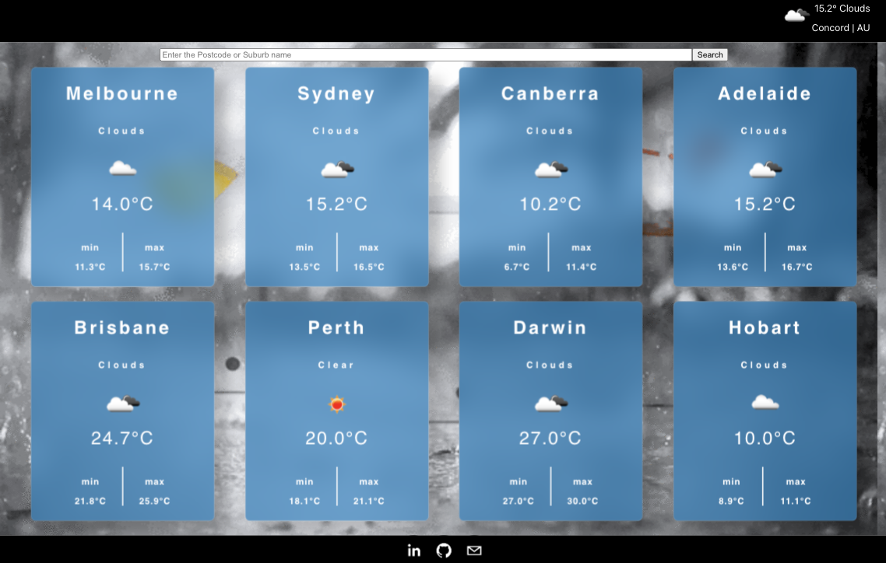

# Service VIC Code Test

This project is a code test from [Service VIC](https://service.vic.gov.au/)

## Main Code

- `LIVE VSCode`(now way to read code without `git clone` or `down`)
  https://github1s.com/smartnelly/serviceVic

## Features

1. Search cities functionality

2. Current local weather

3. Australian major city Temperatures

4. Responsive Web Design

## Run Code

- `npm install`
- `npm run build`
- `npm start`

## Code Test Description

### Front End - React Coding Exercise

Use `Create-React-App` to build a weather app, displaying the current weather conditions of Australia’s major capital cities.

### Tasks:

- Display the name of the city, current temperature and conditions, in a user-friendly responsive UI.

- Retrieve the data using the OpenWeather API: https://openweathermap.org/current

### Tech Stack:

Feel free to use whatever packages you feel are necessary but please incorporate the use of:

- Typescript (if possible)

- Use of state management

- React styling methodology

Please avoid using any UI frameworks for this task. (e.g. Bootstrap, Material UI etc)

When creating this project use the techniques you think is best suited and keep in mind:

- Best coding practices

- Scalability

- Reliability

- Reusability

- Responsiveness

- Performance

## Contributions

Any feature requests and pull requests are welcome!

## License

The project is under [MIT license](https://choosealicense.com/licenses/mit/).
